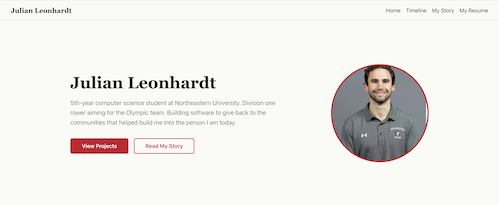
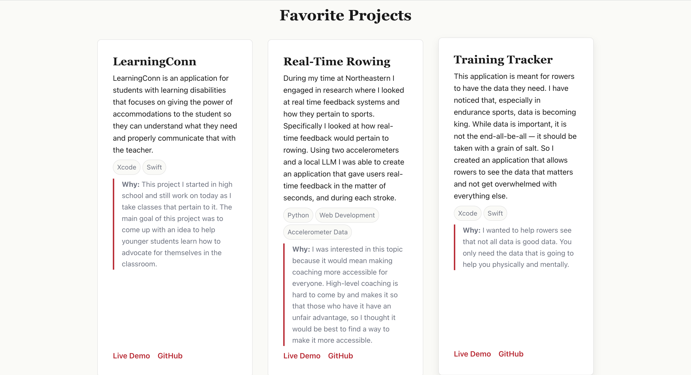
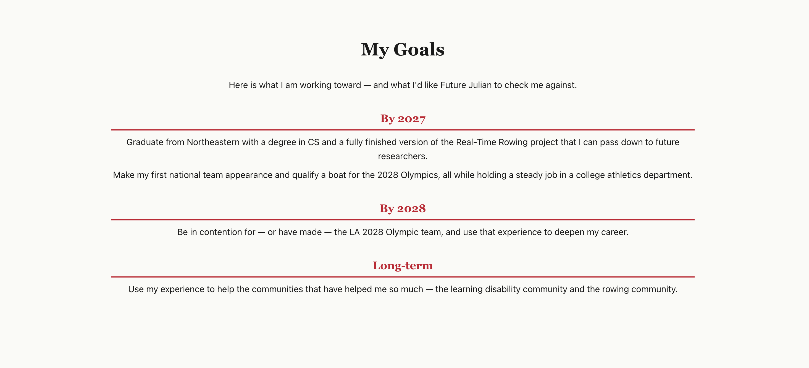
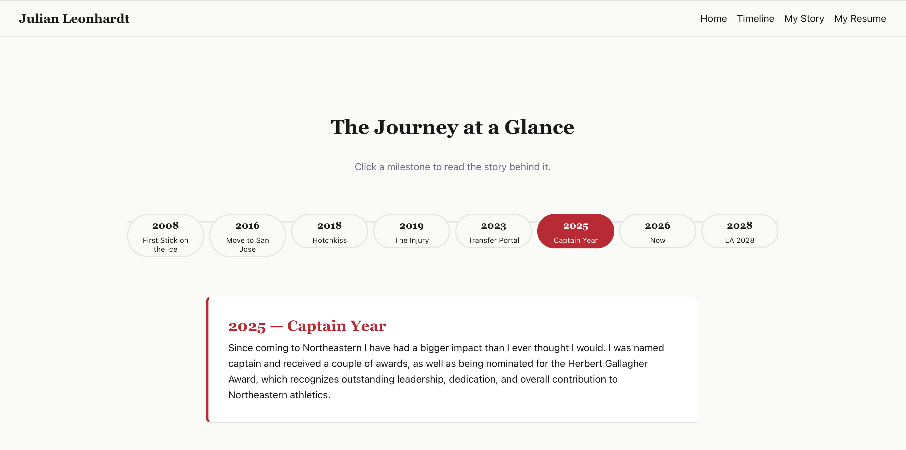
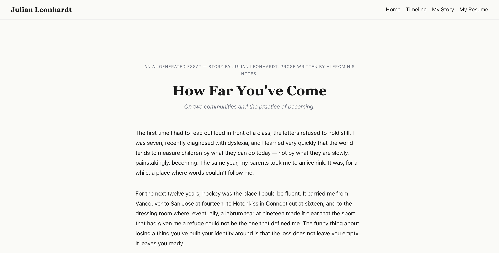

# Personal Website

**Author:** Julian Leonhardt

**Class:** [Introduction to Web Development — Summer 2026](https://johnguerra.co/classes/webDevelopment_online_summer_2026/)

## Project Objective

A personal homepage built with vanilla HTML5, CSS3, and ES6+ JavaScript. The
site introduces who I am, showcases my portfolio, and shares the hobbies and
interests that shape how I work and create.

## Screenshots











## Live Site

[Video Demo](https://youtu.be/wGmoQGcFV0g)

[Page cite](https://julianleonhardt2.github.io/PersonalWebsite/)

## Tech Stack

- HTML5
- CSS3 (Flexbox / Grid)
- ES6+ JavaScript (modules)
- Prettier for formatting
- ESLint for linting

## Instructions to Build

This is a static site — there is no build step. To run it locally:

1. Clone the repository:
   ```bash
   git clone https://github.com/JulianLeonhardt2/PersonalWebsite.git
   cd PersonalWebsite
   ```
2. Install dev dependencies (for Prettier and ESLint):
   ```bash
   npm install
   ```
3. Open `index.html` directly in your browser, **or** serve the folder with a
   simple static server (any will do):
   ```bash
   npx serve .
   ```

### Available Scripts

| Command                | Description                         |
| ---------------------- | ----------------------------------- |
| `npm run format`       | Format all files with Prettier.     |
| `npm run format:check` | Check formatting without writing.   |
| `npm run lint`         | Lint JS and HTML files with ESLint. |

## Use of Generative AI

This project was built collaboratively with **Anthropic's Claude (Opus 4.7,
1M-context)** acting as a teaching assistant and pair-programmer through the
Claude Code CLI. Below is a transparent breakdown of what was AI-assisted
versus what I wrote myself.

### Model + tool

- **Model:** Claude Opus 4.7 (1M context)
- **Interface:** Claude Code CLI (VS Code extension)

### What was AI-assisted

- **Design document scaffolding (`docs/design.md`):** The three user personas
  (Sarah Patel, Diego Murphy, Future Julian) and the six user stories were
  drafted by Claude after I answered questions about who my audience is. I
  edited details (Diego's relationship to me, age changes, etc.) to fit my
  actual context.
- **AI-generated essay page (`ai.html`):** The entire essay _"How Far You've
  Come"_ was written by Claude from biographical notes I provided about my
  rowing journey, dyslexia diagnosis, schools I attended, and my goals. I
  reviewed it for factual accuracy and edited a few invented details.
- **Code scaffolding:** Claude provided template HTML, CSS, and JavaScript
  snippets explaining each concept. I typed the code into my files myself,
  one section at a time. Claude reviewed each section and pointed out bugs
  (typos like `soild`/`solid`, missing CSS rules, the `tagLine`/`tagline`
  case mismatch, etc.).
- **Prose cleanup:** Claude fixed spelling, grammar, and capitalization
  across my project descriptions, journey chapters, and timeline panels.
  The voice and content are mine; the surface polish is Claude's.
- **Prompt used:** Pretend that you are an advanced full stack engineer. I am    creating a personal website for the class I am taking, Introduction to web-development. I am still a little confused on some of the concepts so I would like to walk through the code and I will let you know when I understand. There will be a page that will be created purly from AI, we will do that last and I will give you insight into what I want there. But for the first part I would like to write all of the code, but you can help guide me/ provide me with examples. Think of it as an exerice to help me really learn the concepts. Do not write the code for me, otherwise I will not learn.


### What I wrote myself

- All technical decisions (page structure, scope, what to include and
  exclude).
- All factual content: my biography, project descriptions (LearningConn,
  Real-Time Rowing, Training Tracker), goals, and the milestones on the
  hobbies timeline.
- The hand-drawn mockup sketches in `images/`.
- The project's philosophy line (used in the footer and quoted in the
 essay): _"People should not be measured by their accomplishments but
  rather by how far they have come from where they started."_
- All of the actual code typing (Claude gave me some outlines but I wrote the code myself).

### Sample prompts used

- _"Pretend you are an advanced full-stack engineer. I am creating a
  personal website for my Intro to Web Development class. I would like to
  write all the code myself, but you can help guide me and provide
  examples."_
- _"Draft the three user personas for me based on what we've discussed."_
- _"Generate a reflective essay tying my two threads together — the
  dyslexia community, the rowing community, the 'ability is how far
  you've come' philosophy, and the giving-back ambition."_
- _"Walk me through how flexbox works, then have me write the CSS for the
  header."_

## License

This project is licensed under the [MIT License](./LICENSE).
