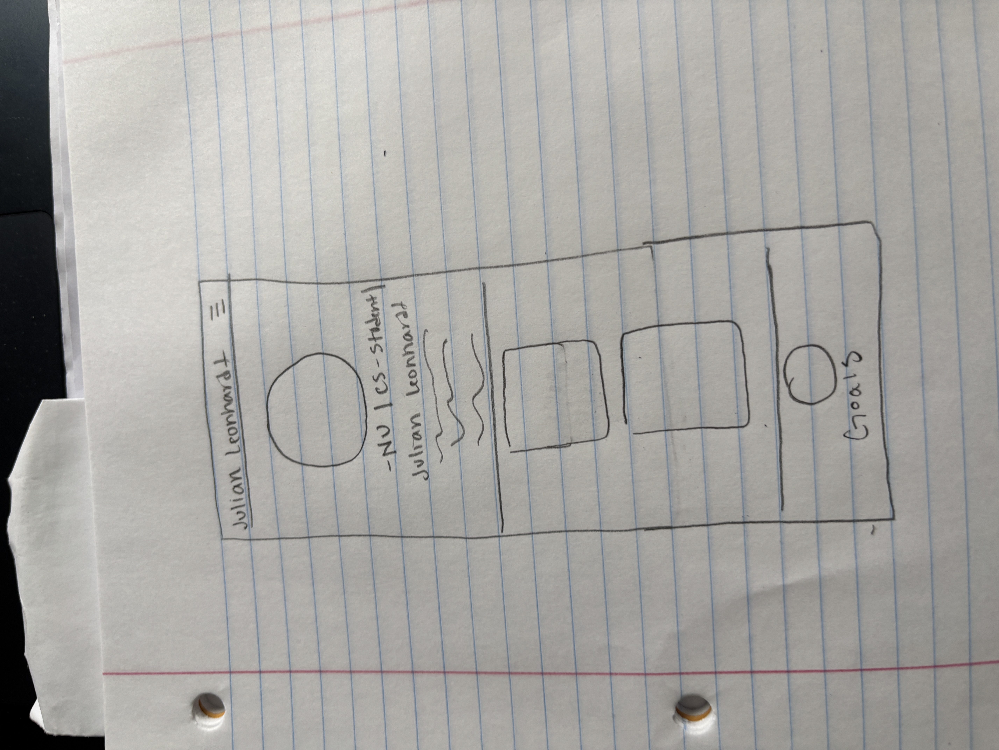

# Design Document - Julian Leonhardt's Personal Website

## 1. Project Description

This site is the personal homepage of Julian Leonhardt — a fifth-year computer science student at Northeastern University and a varsity athlete on the Northeastern men's rowing team. It serves two audiences in parallel: recruiters and peers who want a snapshot of Julian's technical work, and Julian himself, who is using the site as a checkpoint to track his own growth across his Introduction to Web Development course and beyond.
What makes this site different is that it's organized around a story rather than a list of credentials. Julian believes that people's ability should not be based on what they have achieved but rather how far they have come to become the person they are today. Julian's path through college has been shaped by two communities that don't usually intersect: the learning disability community, as Julian was diagnosed with pretty severe dyslexia at a young age, and the rowing community as rowing is a larger reason he is where he is today.
The site's portfolio page highlights computer science work, while the hobbies page traces the rowing journey driving Julian toward an eventual goal of competing for an Olympic medal. Together, those two pages frame an ambition that ties them back together - using software to give back to the communities that made his own path possible.

## 2. User Personas

### Persona 1 — Sarah Patel, Early-Career Tech Recruiter

- **Context:** 31, technical recruiter at a mid-sized Boston software company. Sources candidates for software engineering internships and new-grad roles. Reviews 30+ portfolios a week, often on a laptop with two screens — applicant tracker on one side, the candidate's site on the other.
- **Goals:**
  - Decide within 60 seconds whether Julian is worth a phone screen.
  - See concrete projects with working links and a clear stack list.
  - Find a downloadable résumé and a LinkedIn link without hunting.
- **Frustrations:**
  - Portfolios where every project is just a screenshot, with no live link or repo.
  - Long autobiographical intros that delay the actual work.
  - Sites with no contact information or broken links.
- **How she finds the site:** LinkedIn bio link, referral from a Northeastern alum on her team, or a GitHub repo README.

### Persona 2 — Diego Murphy, Fellow Northeastern CS Student

- **Context:** 19, sophomore CS major at Northeastern. Was Julian's teammate for a season on the men's rowing team and would like to see what classes to take at his time at Northeastern. Browsing on his phone between classes.
- **Goals:**
  - See realistic, student-scale projects he could imagine building himself.
  - Understand how Julian balances Division I athletics with a CS workload.
  - Find a way to reach out (LinkedIn DM, GitHub follow, or email).
- **Frustrations:**
  - Sites that read like a recycled LinkedIn page with no personality.
  - Vague project descriptions with no code to actually look at.
  - Mobile layouts that overflow or hide the navigation.
- **How he finds the site:** Class group chat, a link in Julian's GitHub profile, or stumbling onto a shared repo.

### Persona 3 — Future Julian, Two Years From Now

- **Context:** 25, recent Northeastern graduate. Possibly working as a software engineer; possibly mid-training cycle for an international rowing season. Returns to the site as a checkpoint to see what he cared about and committed to as an undergrad.
- **Goals:**
  - Compare his current skills to where he was at the time of writing.
  - Re-read the "why" behind early projects and remember the version of himself who started them.
  - Use the site as a record that the story he was telling actually played out.
- **Frustrations:**
  - Past-Julian under-documenting projects or skipping the context behind them.
  - Outdated links, broken images, or a site that no longer deploys.
  - Tone that feels overly polished and doesn't sound like him anymore.
- **How he finds the site:** A bookmark, or the live link still pinned at the top of his GitHub profile.

## 3. User Stories

### Story 1.1 — Sarah's 60-second decision

_As a recruiter, I want to see Julian's three strongest projects and the technologies he used within the first scroll of the homepage, so that I can decide in under a minute whether he's worth a phone screen._

Sarah opens the site on her laptop between two scheduled interviews. She doesn't read the bio first — her eyes go straight to the projects section. Each tile has a title, a one-line description, and a short stack list (e.g. "React · Node · Postgres"). If a tile has a live demo, she clicks it; otherwise she opens the GitHub repo. Within a minute she has either dragged Julian's name into her shortlist or closed the tab.

### Story 1.2 — Sarah needs the résumé in one click

_As a recruiter, I want to find Julian's résumé and LinkedIn from any page on the site, so that I can forward a complete profile to my hiring manager without hunting._

Once Sarah has decided Julian is a maybe, she needs the official paperwork. She doesn't want to scroll to the bottom of a long page or guess which menu item hides the contact info. There's a "Résumé" link in the header (or footer) and a LinkedIn icon nearby. One click downloads the PDF; one click opens LinkedIn in a new tab.

### Story 2.1 — Diego browses on his phone between classes

_As a fellow CS student at Northeastern, I want to read Julian's project descriptions on my phone without zooming or sideways scrolling, so that I can actually engage with his work during a five-minute break._

Diego sees a link to Julian's site dropped in the team's group chat and opens it before his next lecture. The header is readable on his phone, the project tiles stack into a single column, and tapping a project title takes him to the repo or live demo. If the layout overflows or the text is too small to read, he closes the tab and forgets about it.

### Story 2.2 — Diego wants the underclassman roadmap

_As a sophomore who shares an unusual schedule, I want to read about Julian's rowing journey and skim the CS classes behind his projects, so that I can sketch out what my own next two years could look like._

Later that night, Diego is back on the site from his laptop. He clicks the "Hobbies" link in the nav and reads how Julian balanced Division I rowing with a CS workload — what brought him to the sport, what it taught him about working under pressure, and where it's aiming next. He then jumps back to the projects and tries to figure out which classes produced which projects, looking for a path he could imagine following himself.

### Story 3.1 — Future Julian comes back to compare

_As Future Julian, I want to land on the site and immediately see what I prioritized and built during my first web development class, so that I can measure how far I have come since then._

Two years from now, Julian opens the bookmarked URL late at night. The homepage still loads. He skims his old project list and bio paragraph and notices how he chose to describe himself at the start of his web-development journey. The contrast between what he wrote then and where he is now is the whole point of returning.

### Story 3.2 — Future Julian re-reads the "why"

_As Future Julian, I want each project on the portfolio page to include the reason I built it — not just the stack — so that I can remember the motivation that started this entire path._

Future Julian clicks into an old project. The page doesn't just list "React, Node, Postgres" — it includes a short note about why he built it: a class assignment, an idea sparked by a teammate, or an attempt to help his own studying around dyslexia. That note is the artifact he came back for. It is the version of himself he was preserving.

## 4. Design Mockups

### Homepage — Desktop

Above the fold: name, one-liner bio, and a portrait. Three featured project tiles ("LearningConn," "Real-time Rowing," and "Training Tracker") sit immediately below the portriat so that the recuiter can see (serves **Story 1.1**). A dedicated "My Goals" section near the bottom gives Future Julian a checkpoint to look back on (**Story 3.1**). Persistent nav with a résumé link in the top-right satisfies **Story 1.2**.

### Hobbies Page — Desktop

Same header as the homepage for consistency. A "Things I like to work on" section pairs a live GitHub feed with a featured project callout that can be rotated over time — keeping the page evergreen without layout changes. The hobbies page is where the rowing journey and the broader story live, serving **Story 2.2** (Diego wants the underclassman roadmap).

### Homepage — Mobile

Header collapses to a hamburger menu. Hero text and portrait stack vertically. Project tiles drop from a three-across grid into a single column so they're readable without horizontal scrolling. Touch targets are sized for thumbs. Directly serves **Story 2.1** — Diego browsing on his phone between classes.

### AI-Generated Page — Concept

A timeline-based "story" page that walks visitors through key moments in Julian's path (2021 start rowing → 2023 transfer to Northeastern → 2026 medal at Eastern Sprints, plus future milestones). This page will be generated last with AI assistance and will be the most direct expression of the "I want to tell my story" hook from the project description.
